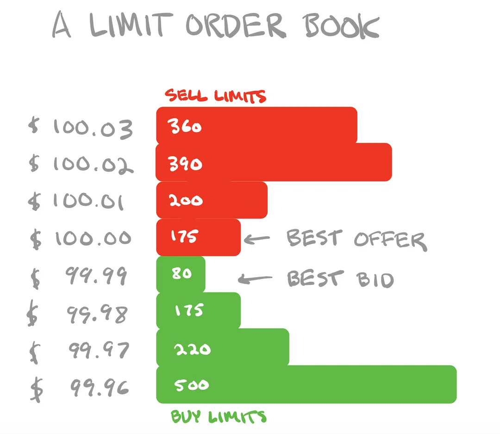

# Introduction

This is a self study report with focus on statstical arbitrage. Statstical arbitrage is a class of systematic trading algortihm which tries to find relatively mispriced instruments. The trade is entered by going short on relatively expensive instrument and long on relatively cheap instrument. Usually such strategies have very low drawdown and low correlation to market whiach are desireable features. I have already used some terms that mey require further explanations. The outline of the paper is as follows

- Introduction to concepts of trading & financial markets
- Paper 1
- paper 2
- Further discussion & conclusion.
  
# Introduction to concepts of trading & financial markets

Financial market offer access to capital. It helps entureprenurship. Modern day
 financial markets are electronically driven. It offers a platform to match 
buyers and sellers. It also offers many investors, big or small, an opportunity
to invest and work towards their financial wellbeing.

__Order type__ : Overtime exchanges have started offering multiple order type to 
faciliatate transaction but the most important ones, for our discussion, are _limit
order_ and _market order_. 

_Market order_ are placed to transact at the market prevaling price. In order to
place a market order a participant specifies the instrument, side i.e, buy side or
sell side and the quantity. Typically a 
market order is filled almost immidiately if there is a counter party available.
Since the no price is stated in case of market order, you order is matached with 
best available bid or ask. Your buy order will match asgainst best available ask
and your sell order will be matched against available best bid. Some trading 
organizations are in the business of making quotes i.e. bid and ask. They are 
called market makers.

_Limit Order_ are placed to transact at a given price. In order to place a limit
order participant specifies the instrument, quantity, limit price i.e. the price 
at which the order should be filled. If your limit price is worse or equal to the
best quotes you get an immidiate fill at best quote. If your limit price is worse than best quote and you get a fill at quote effectively you get a fill price better than your limit price. In such a case your order is called an aggresive order as you choose to move across the bid ask gap. You can also choose a limit price better than best quote in which case your order becomes a resting order. As price evolves over time your order might get matched against other market order or an aggressive limit order

__Limit order book__ : 

The exchange keeps a track of all resting limit order as limit order book (LOB). Market orders and aggressive limit orders are matched against these resting orders. Often called visually the LOB this is represented as shown in figure.

# Trades and Position

The act of order getting match or fill is called _trade_. The end result is that it impacts the Position of the participant. If you buy instrument X for n quantity, you position is increased by n for instrument x. If you sell instrument X for n quantity.

Participant can choose to buy followed by a sell. Initially the position will increase and finally it will go flat. The participant makes a profit if price of instrument increases after he buys and before he sells. Taking such position is also known as going _long_. Alternatively he can place a bet that the price of the instrument will go down. In such a sell order is followed by a buy order and position goes from negative to zero/flat. Taking such a position is known as going _short_. Based on the context, instrument etc. there might be some restrictions on shorting a instrument.

# Returns and Risk

_Returns_ is the percent change in the asset price over a given preiod. Period in question can be hour, day, month, year etc. Mathematically it cna be defined as $R(t)  = \frac{P(t)}{p(t-\Delta t)}$ where $p(t)$ is price of instrument over time and $\Delta t$ is the time period.

_Risk_ is often quantified as uncertainity of returns or sandard deviation of returns. Returns of equity are often naively modelled as a random variable with certain mean and standard deviation. This modelling is inaccurate as the return distributions have a fatter tails when compared to gaussian but it gives a good starting point.

# Investment strategies

Some investors like investment stategies with low beta i.e. low correlation to market index. Typically this leads to lower drawdowns. There are various class of investment strategies amongst them _statistical arbitrage_ is known to be have relatively lower drawdowns.

# Statistical arbitrage concepts

_Stationarity_ in case of time series implies a constant mean and variance. What that means is all samples are from the same distribution. If something is not stationary and we do some kind of learning or estimation we will be trying to estimate a time varying paramters value as constant.

Stock prices are usually non stationary and typically differencing them once leads to a stationary time series. In general the minimum number of time a time serires needs to be differenced to bring it to a stationary series is the _order of integration_ of that series.

If there exist a linear combination of 2 or more nonstatinary time series such that the linear combination timeseries leads to a stationary time series, the combinationa is said to be cointegrated.

# Paper 1

In this section we disscuss a paper title _"Advanced Statistical Arbitrage with Reinforcement Learning"_ [@ningAdvancedStatisticalArbitrage2024]. Here are some of the salient features of the work.

- There no explicit model assumption on spread.
- They introduce a RL model for decision making on entry and exit.
- For spread construction phase they propose a an empirical mean reversion time metric
- The metric is used in optimization for constructing a spread

The essence of statistical arbitrage lies in creating spreads or portfolios from the market that exhibit mean-reverting characteristics, thereby unlocking opportunities for profit. For instance, if the price of a spread falls below its long-term mean, a trader might take a long position and then wait until its price correction, aiming to profit from this adjustment. Mean reversion or statistical arbitrage into following main elements

1. Identify securities that move together
2. Make mean reverting spreads
3. Identify entry and exit criterion

## Proposed Framework

_Empirical Mean Reversion Time_: The authors introduce a new metric called empirical mean reversion time (EMRT) to measure the speed at which a spread reverts to its mean. This metric is used to construct mean-reverting spreads without relying on theoretical assumptions.

_Reinforcement Learning for Trading_: The trading phase employs an RL framework to dynamically optimize trading decisions. The state space is designed to capture recent price movements, and the reward function is tailored to reflect the characteristics of mean reversion trading.

## Experiments

_Training_:The authors first test their framework on simulated Ornstein-Uhlenbeck (OU) processes, demonstrating that the RL model can effectively identify trading opportunities and generate significant profits.

_Data_: The framework is then applied to real-world data from the S&P 500, comparing its performance against traditional methods like the Distance Method (DM) and OU mean reversion trading. The RL-based approach outperforms these benchmarks in terms of daily Sharpe ratio and cumulative returns.

## Results
The RL-based strategy consistently outperforms traditional methods across various sectors, demonstrating its robustness and effectiveness in real-world trading scenarios.The proposed method achieves higher cumulative profits and better risk-adjusted returns (Sharpe ratio) compared to the benchmarks.

# Paper2

In this section we will discuss a paper titled "Correlation Matrix Clustering for Statistical Arbitrage  Portfolios". For details, the readers may refer [@carteaCorrelationMatrixClustering2023]. Here are the major contributions of the paper

- Construct statistical arbitrage portfolios using graph clustering algortihm. Use of spectral clustering to the design of statistical arbitrage strategies.
- Sharpe ratio above 1 and annualized returns over 10%
- Framework is model agnostic

## Clustering

This paper employs spectral graph clusterting algorithm to identiy group of stocks that _co-move_. Then mean reverting portfolios are created within each cluster and performance is evaluated. 

The paper explores clustering algorithms:
- SPONGE clustering.
- A modified variant of Spectral clustering.
- Signed laplacian clustering

## Portfolio construction

At the begining of each period privious winner and past losers are identified. Stock with return above the portfolio mean are considered past winners and stocks with return below the portfolio mean return are considered past winner. A contrarian portfolio is constructed by taking long positions on previous losers and short positions on previous winners, aiming to exploit mean-reversion patterns.

## Results

### data
The study uses stock price data from the CRSP database (2000-2022) and focuses on the top 25% of stocks by market capitalization. The performance of the clustering-based portfolios is compared with two benchmarks: the SPY ETF and a portfolio based on Fama-French 12 industry classifications.

### Performance

The portfolios are evaluated using annualized returns, Sharpe ratios, and Sortino ratios.The SPONGE clustering algorithm delivers the highest performance, with annualized returns exceeding 12% and Sharpe ratios above 1.1.
The clustering-based portfolios outperform the SPY ETF and perform similarly to the Fama-French 12 industry portfolio. The correlation between the clustering-based portfolios and the SPY ETF is close to zero, confirming that the portfolios are market-neutral. The clustering algorithms detect mean-reversion patterns that are not fully explained by intra-industry relationships.The performance of the portfolios is robust to the choice of clustering algorithms and the number of clusters. The dynamic selection of clusters captures changes in market dynamics, especially during periods of financial stress (e.g., the 2008 financial crisis).

# Conclusion

In this self study, following things were achieved.
- Important concepts relating to algorithmic trading strategies were introduced
- Statstical arbitrage as a class of strategies is introduced
- 2 recent paper in the fileld of statstical arbitrage are discussed.

# References

